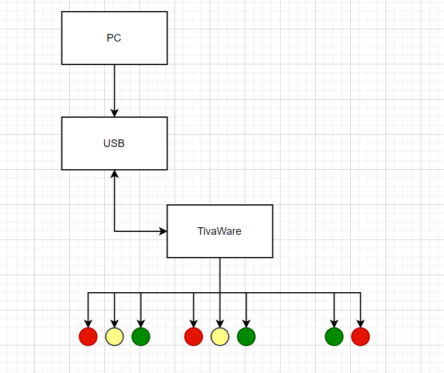
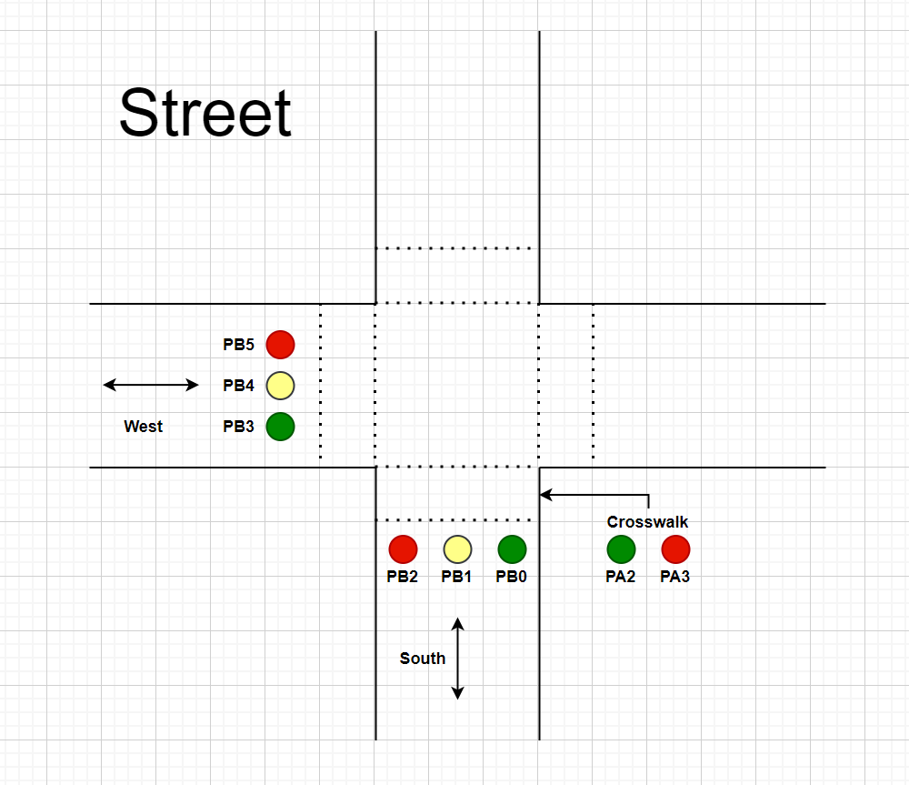

## ENGR 478 Traffic Lights Final Project

<h2> Background </h2>
The proposed idea was to build a remote controlled lamp that users can interact with by using an iOS based application. As the initial plan did not work due to the time constraint and also the inability to built a workable application, another idea that came into mind was to create a simulation of a traffic light. 

<h2> Project Description </h2>
The project creates a simulation of a traffic light, which controls flow of traffic for cars and pedestrians to follow. Traffic lights are there to ensure that everyone on the road is safe and reduce the chances of accidents. The goal of this project is to help understand how traffic light works and create a simulation of it using the Tiva Launchpad Microcontroller and a circuit with LEDs and wires. The main component of this project is implementing the simulation with the concept of periodic interrupt and Timer0A which is going to help loop our LEDs through each state.

<h4> System Architecture </h4>

<h4> Traffic Lights Diagram </h4>

<h4> Results of Project </h4>
The link that is provided below is the video to demonstrate the results of our project. The simulation is a continuous loop of the light turning on from the East/West Direction of cars and pedestrian crossing to the North/South direction.

https://drive.google.com/file/d/1kpBDTwzpZImwBYgF6U_FX86WS8rT6iO5/view?usp=sharing
