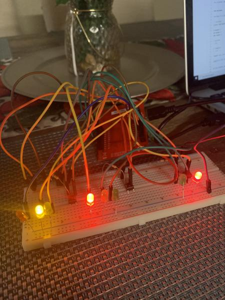

## ENGR 478 Traffic Lights Final Project

## Background
The proposed idea was to build a remote controlled lamp that users can interact with by using an iOS based application. As the initial plan did not work due to the time constraint and also the inability to built a workable application, another idea that came into mind was to create a simulation of a traffic light. 

## Project Description
The project creates a simulation of a traffic light, which controls flow of traffic for cars and pedestrians to follow. Traffic lights are there to ensure that everyone on the road is safe and reduce the chances of accidents. Traffic lights consist of controlling the traffic in the North, East, South, and West direction

### Markdown


Markdown is a lightweight and easy-to-use syntax for styling your writing. It includes conventions for

```markdown
Syntax highlighted code block

# Header 1
## Header 2
### Header 3

- Bulleted
- List

1. Numbered
2. List

**Bold** and _Italic_ and `Code` text

[Link](url) and 
```

For more details see [GitHub Flavored Markdown](https://guides.github.com/features/mastering-markdown/).

### Jekyll Themes

Your Pages site will use the layout and styles from the Jekyll theme you have selected in your [repository settings](https://github.com/edmundzano/ENGR478_TrafficLight/settings). The name of this theme is saved in the Jekyll `_config.yml` configuration file.

### Support or Contact

Having trouble with Pages? Check out our [documentation](https://docs.github.com/categories/github-pages-basics/) or [contact support](https://github.com/contact) and we’ll help you sort it out.
